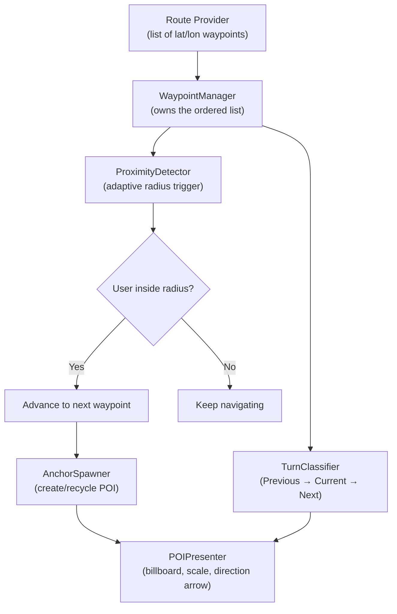
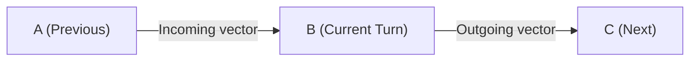
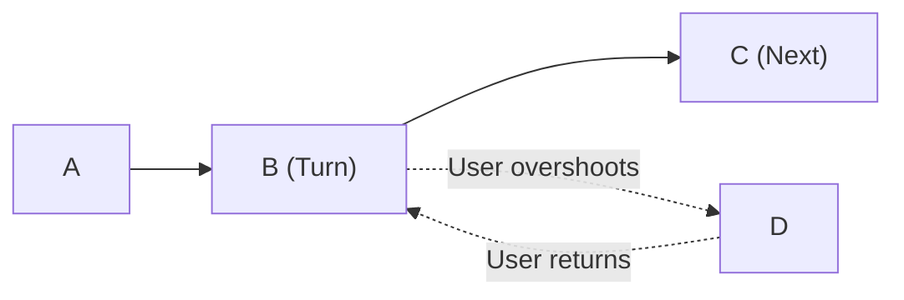
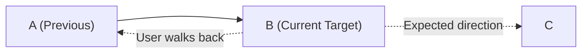
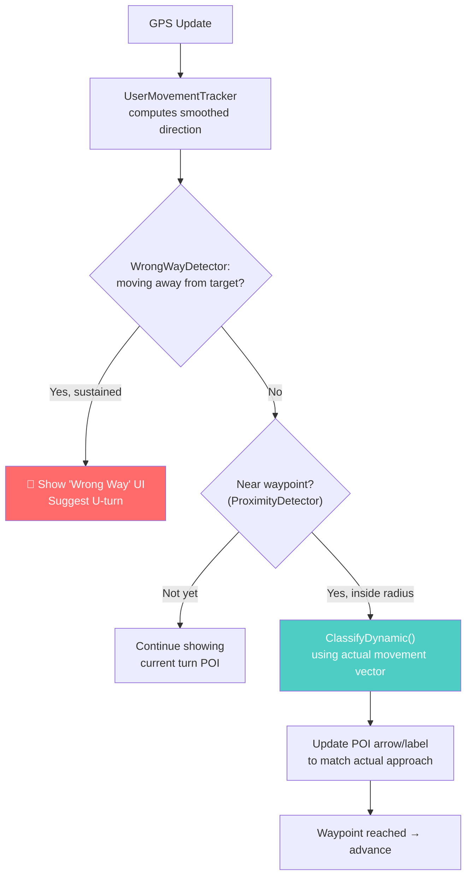
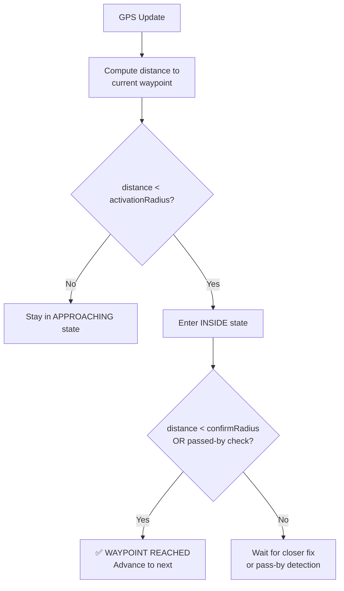
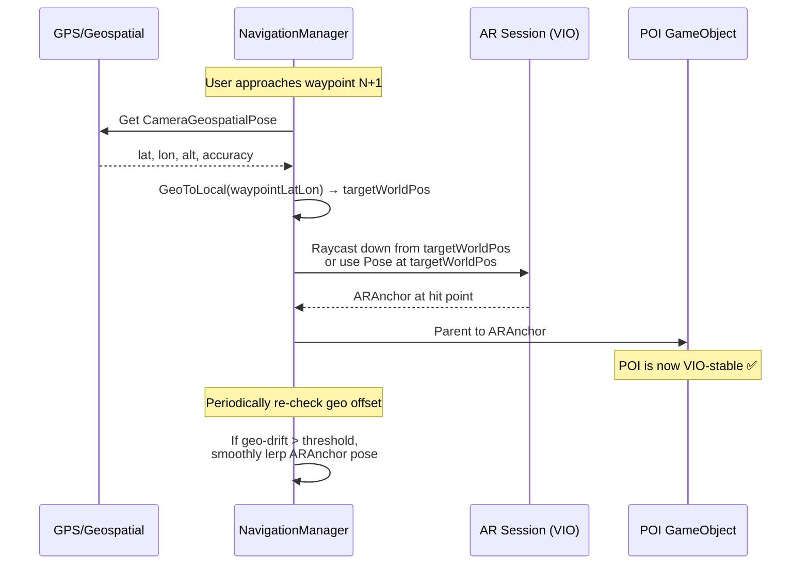

# Outdoor AR Waypoint Navigation — GPS-Only Architecture Guide

## Table of Contents
1. [Architecture Overview](#1-architecture-overview)
2. [Coordinate Conversion: Lat/Lon → Local Unity Space](#2-coordinate-conversion-latlonaltitude--local-unity-space)
3. [Turn Detection Math](#3-turn-detection-math)
4. [GPS Drift & Waypoint Threshold System](#4-gps-drift--waypoint-threshold-system)
5. [Anchor Strategy for Turn POIs](#5-anchor-strategy-for-turn-pois)
6. [UX: Billboarding, Scaling, Height Clamping & Compass Drift](#6-ux-billboarding-scaling-height-clamping--compass-drift)
7. [Full Integration: NavigationManager](#7-full-integration-navigationmanager)

---

## 1. Architecture Overview



### Key Principles (GPS-Only, No VPS)

> [!IMPORTANT]
> Without VPS, your `horizontalAccuracy` will typically be **3–10+ meters**. Every design decision below assumes this level of uncertainty.

| Concern | Strategy |
|---|---|
| Positional accuracy | Dynamic threshold scaled by `horizontalAccuracy` |
| Anchor stability | **Hybrid**: Geospatial for geo-truth, local `ARAnchor` for visual stability |
| Visual jitter | Exponential smoothing on GPS position; billboard + distance-scaled POIs |
| Compass drift | Heading smoothing + dead-reckoning from VIO between GPS updates |

---

## 2. Coordinate Conversion: Lat/Lon/Altitude → Local Unity Space

Before any vector math, we need a reliable way to convert between WGS84 and Unity's coordinate system. The standard approach is to pick a **local origin** (usually the first waypoint or the user's start position) and project everything into a local East-North-Up (ENU) frame.

```csharp
/// <summary>
/// Converts WGS84 geodetic coordinates to a local East-North-Up (ENU)
/// coordinate system centered on a reference point.
/// Unity mapping: X = East, Y = Up, Z = North.
/// </summary>
public static class GeoMath
{
    private const double EarthRadius = 6378137.0; // WGS84 semi-major axis (meters)

    /// <summary>
    /// Returns a Unity Vector3 in meters relative to the reference origin.
    /// </summary>
    public static Vector3 GeoToLocal(
        double lat, double lon, double alt,
        double refLat, double refLon, double refAlt)
    {
        double dLat = (lat - refLat) * Mathf.Deg2Rad;
        double dLon = (lon - refLon) * Mathf.Deg2Rad;
        double refLatRad = refLat * Mathf.Deg2Rad;

        // Meters per degree at reference latitude
        double metersPerDegLat = EarthRadius * Mathf.Deg2Rad;
        double metersPerDegLon = EarthRadius * Math.Cos(refLatRad) * Mathf.Deg2Rad;

        float east  = (float)(dLon / Mathf.Deg2Rad * metersPerDegLon);  // X
        float up    = (float)(alt - refAlt);                              // Y
        float north = (float)(dLat / Mathf.Deg2Rad * metersPerDegLat);  // Z

        return new Vector3(east, up, north);
    }

    /// <summary>
    /// Haversine distance between two geo points, in meters.
    /// Used for proximity checks without needing full ENU conversion.
    /// </summary>
    public static double HaversineDistance(
        double lat1, double lon1, double lat2, double lon2)
    {
        double dLat = (lat2 - lat1) * Mathf.Deg2Rad;
        double dLon = (lon2 - lon1) * Mathf.Deg2Rad;
        double a = Math.Sin(dLat / 2) * Math.Sin(dLat / 2)
                 + Math.Cos(lat1 * Mathf.Deg2Rad) * Math.Cos(lat2 * Mathf.Deg2Rad)
                 * Math.Sin(dLon / 2) * Math.Sin(dLon / 2);
        double c = 2 * Math.Atan2(Math.Sqrt(a), Math.Sqrt(1 - a));
        return EarthRadius * c;
    }
}
```

---

## 3. Turn Detection Math

### The Core Idea

Given three consecutive waypoints **A** (previous), **B** (current), **C** (next), we want to determine whether the user should turn **Left**, **Right**, or go **Straight** at B.



We compute two 2D vectors (ignoring Y/altitude for turn classification):
- **Incoming** = B − A
- **Outgoing** = C − B

Then use the **2D cross product sign** to determine the turn direction, and the **angle between the vectors** to classify severity.

> [!IMPORTANT]
> This static classification (using route geometry A→B) is correct **only when the user approaches B from the A side**. See [Section 3.1](#31-dynamic-turn-reclassification--wrong-way-detection) for handling overshoot/return and backward walking scenarios.

### Code

```csharp
public enum TurnDirection { Straight, Left, Right, UTurn }

/// <summary>
/// Classifies the turn at waypoint B given the path A → B → C.
/// All positions are in local Unity space (X=East, Z=North).
/// </summary>
public static class TurnClassifier
{
    /// <summary>
    /// Threshold angles (degrees) for classifying a turn.
    /// - Angles less than straightThreshold are "Straight"
    /// - Angles greater than uTurnThreshold are "U-Turn"
    /// - Everything in between is "Left" or "Right"
    /// </summary>
    private const float StraightThreshold = 20f;  // degrees
    private const float UTurnThreshold    = 160f;  // degrees

    /// <summary>
    /// Returns the turn direction and the signed angle at B.
    /// Positive angle = Right turn, Negative angle = Left turn.
    /// </summary>
    public static (TurnDirection direction, float angle) Classify(
        Vector3 a, Vector3 b, Vector3 c)
    {
        // 1. Flatten to 2D (XZ plane — East/North)
        Vector2 incoming = new Vector2(b.x - a.x, b.z - a.z);
        Vector2 outgoing = new Vector2(c.x - b.x, c.z - b.z);

        // Guard: degenerate segments
        if (incoming.sqrMagnitude < 0.01f || outgoing.sqrMagnitude < 0.01f)
            return (TurnDirection.Straight, 0f);

        // 2. Signed angle from incoming to outgoing
        //    Positive = clockwise = Right, Negative = counter-clockwise = Left
        float signedAngle = Vector2.SignedAngle(incoming, outgoing);
        // Note: Vector2.SignedAngle returns [-180, 180].
        // Positive = counter-clockwise in Unity's 2D space.
        // Since our 2D is (East, North) and we want map-style rotation:
        //   Counter-clockwise on map = Left turn
        //   Clockwise on map = Right turn
        // Unity's Vector2.SignedAngle: positive = CCW, so:
        //   positive signedAngle → Left turn
        //   negative signedAngle → Right turn

        float absAngle = Mathf.Abs(signedAngle);

        // 3. Classify
        if (absAngle < StraightThreshold)
            return (TurnDirection.Straight, signedAngle);

        if (absAngle > UTurnThreshold)
            return (TurnDirection.UTurn, signedAngle);

        // Positive SignedAngle → CCW → Left; Negative → CW → Right
        TurnDirection dir = signedAngle > 0 ? TurnDirection.Left : TurnDirection.Right;
        return (dir, signedAngle);
    }
}
```

> [!NOTE]
> `Vector2.SignedAngle(from, to)` returns the angle **from** the first vector **to** the second, measured counter-clockwise. On a North-up East-right map, counter-clockwise means **Left**. Verify this with a few known waypoints during development.

### Usage Example

```csharp
Vector3 a = GeoMath.GeoToLocal(latA, lonA, 0, refLat, refLon, 0);
Vector3 b = GeoMath.GeoToLocal(latB, lonB, 0, refLat, refLon, 0);
Vector3 c = GeoMath.GeoToLocal(latC, lonC, 0, refLat, refLon, 0);

var (turn, angle) = TurnClassifier.Classify(a, b, c);
Debug.Log($"At waypoint B: {turn} ({angle:F1}°)");
```

---

## 3.1 Dynamic Turn Reclassification & Wrong-Way Detection

### The Problem

The static `Classify(A, B, C)` assumes the user approaches waypoint B from A. Two scenarios break this:

````carousel
**Scenario 1: Overshoot & Return**

The route says turn **Left** at B. But the user walks straight past B to point D, then turns around and walks back toward B. Now they're approaching B from the C-side — the correct instruction from their perspective is **Right**, not Left.



| Approach direction | Static classification | Correct instruction |
|---|---|---|
| A → B (normal) | Left | Left ✅ |
| D → B (returning) | Left | **Right** ❌ wrong! |
<!-- slide -->
**Scenario 2: Walking Backward**

The user turns 180° and walks back toward the previous waypoint. They are now moving away from the target. The system should detect this and warn the user rather than continuing to show turn instructions for a waypoint they're moving away from.


````

### Solution: Use the User's Actual Movement Vector

Instead of always using the route segment (A→B) as the incoming vector, substitute the **user's real-time smoothed movement direction** when they are near the waypoint. This automatically handles any approach angle — whether normal, overshooting and returning, or approaching from a side street.

### 3.1.1 UserMovementTracker

Tracks the user's actual movement direction from GPS history.

```csharp
using UnityEngine;
using System.Collections.Generic;

/// <summary>
/// Tracks the user's actual movement direction by averaging recent GPS
/// position deltas. Provides a smoothed 2D heading vector (East, North)
/// that represents which direction the user is actually walking.
/// </summary>
public class UserMovementTracker
{
    private struct Sample
    {
        public Vector2 position; // (East, North) in local space
        public float   time;
    }

    private readonly Queue<Sample> _samples = new();
    private readonly float _windowSeconds;
    private readonly float _minMovementMeters;

    /// <summary>
    /// The user's smoothed movement direction (East, North).
    /// Zero vector if the user is stationary.
    /// </summary>
    public Vector2 SmoothedDirection { get; private set; } = Vector2.zero;

    /// <summary>
    /// True if we have enough movement data to trust the direction.
    /// </summary>
    public bool HasValidHeading { get; private set; } = false;

    /// <summary>
    /// Speed in meters/second (smoothed).
    /// </summary>
    public float Speed { get; private set; } = 0f;

    /// <param name="windowSeconds">Time window for averaging (e.g., 3 seconds).</param>
    /// <param name="minMovementMeters">Minimum displacement to consider
    /// the user "moving" (filters out GPS jitter while standing still).</param>
    public UserMovementTracker(float windowSeconds = 3f, float minMovementMeters = 2f)
    {
        _windowSeconds = windowSeconds;
        _minMovementMeters = minMovementMeters;
    }

    /// <summary>
    /// Call every GPS update with the user's current local-space position.
    /// </summary>
    public void Update(Vector2 localPositionEN, float time)
    {
        _samples.Enqueue(new Sample { position = localPositionEN, time = time });

        // Trim old samples outside the window
        while (_samples.Count > 0 && _samples.Peek().time < time - _windowSeconds)
            _samples.Dequeue();

        if (_samples.Count < 2)
        {
            HasValidHeading = false;
            Speed = 0f;
            return;
        }

        // Compute displacement from oldest to newest sample in window
        var oldest = _samples.Peek();
        var newest = localPositionEN;
        Vector2 displacement = newest - oldest.position;
        float dt = time - oldest.time;

        if (dt < 0.1f)
        {
            HasValidHeading = false;
            return;
        }

        float distance = displacement.magnitude;
        Speed = distance / dt;

        if (distance < _minMovementMeters)
        {
            // User is essentially stationary — don't update heading
            HasValidHeading = false;
            return;
        }

        SmoothedDirection = displacement.normalized;
        HasValidHeading = true;
    }

    public void Reset()
    {
        _samples.Clear();
        SmoothedDirection = Vector2.zero;
        HasValidHeading = false;
        Speed = 0f;
    }
}
```

### 3.1.2 Dynamic TurnClassifier Overload

A new overload that accepts the user's actual approach direction instead of deriving it from the route:

```csharp
public static class TurnClassifier
{
    // ... (existing Classify(a, b, c) method from Section 3 remains unchanged) ...

    /// <summary>
    /// Classifies the turn using the user's ACTUAL approach direction
    /// instead of the static route geometry. This correctly handles:
    /// - Overshoot & return (user approaches from opposite side)
    /// - Side-street approaches
    /// - Any non-standard approach angle
    /// </summary>
    /// <param name="userMovementDir">
    ///   Smoothed 2D movement vector (East, North) from UserMovementTracker.
    /// </param>
    /// <param name="waypointPos">The current waypoint position (local XZ).</param>
    /// <param name="nextWaypointPos">The next waypoint position (local XZ).</param>
    public static (TurnDirection direction, float angle) ClassifyDynamic(
        Vector2 userMovementDir,
        Vector3 waypointPos,
        Vector3 nextWaypointPos)
    {
        // The "incoming" is the user's actual direction of travel
        Vector2 incoming = userMovementDir;

        // The "outgoing" is still the route: current waypoint → next waypoint
        Vector2 outgoing = new Vector2(
            nextWaypointPos.x - waypointPos.x,
            nextWaypointPos.z - waypointPos.z);

        if (incoming.sqrMagnitude < 0.001f || outgoing.sqrMagnitude < 0.001f)
            return (TurnDirection.Straight, 0f);

        float signedAngle = Vector2.SignedAngle(incoming, outgoing);
        float absAngle = Mathf.Abs(signedAngle);

        if (absAngle < StraightThreshold)
            return (TurnDirection.Straight, signedAngle);

        if (absAngle > UTurnThreshold)
            return (TurnDirection.UTurn, signedAngle);

        TurnDirection dir = signedAngle > 0 ? TurnDirection.Left : TurnDirection.Right;
        return (dir, signedAngle);
    }
}
```

### 3.1.3 WrongWayDetector

Detects when the user is walking **away** from the current target waypoint.

```csharp
/// <summary>
/// Detects when the user is moving in the wrong direction (away from
/// the current target waypoint). Triggers after sustained wrong-way
/// movement to avoid false alarms from brief GPS jumps.
/// </summary>
public class WrongWayDetector
{
    // --- Configuration ---
    private readonly float _angleTolerance;        // degrees from "directly away"
    private readonly float _sustainedDurationSec;  // seconds of wrong-way before alert
    private readonly float _minSpeedMps;           // ignore if user is barely moving

    // --- State ---
    private float _wrongWayAccumulator = 0f;
    private bool  _isWrongWay = false;

    /// <summary>True when the user has been walking the wrong way long enough.</summary>
    public bool IsWrongWay => _isWrongWay;

    /// <param name="angleTolerance">
    ///   How many degrees from "directly away" still counts as wrong-way.
    ///   e.g., 60 means any heading within ±60° of "directly away" is wrong.
    /// </param>
    /// <param name="sustainedDurationSec">
    ///   How many seconds of sustained wrong-way walking before triggering.
    ///   Prevents GPS jitter from causing false alarms.
    /// </param>
    /// <param name="minSpeedMps">
    ///   Minimum speed (m/s) to consider the user "moving".
    ///   Below this, we assume stationary and don't flag wrong-way.
    /// </param>
    public WrongWayDetector(
        float angleTolerance = 60f,
        float sustainedDurationSec = 4f,
        float minSpeedMps = 0.5f)
    {
        _angleTolerance = angleTolerance;
        _sustainedDurationSec = sustainedDurationSec;
        _minSpeedMps = minSpeedMps;
    }

    /// <summary>
    /// Call every frame/GPS update.
    /// </summary>
    /// <param name="userMovementDir">Smoothed 2D movement direction (East, North).</param>
    /// <param name="userSpeed">User speed in m/s.</param>
    /// <param name="directionToWaypoint">2D vector FROM user TO target waypoint.</param>
    /// <param name="deltaTime">Time.deltaTime or GPS update interval.</param>
    /// <returns>True if wrong-way alert should be shown.</returns>
    public bool Update(
        Vector2 userMovementDir, float userSpeed,
        Vector2 directionToWaypoint, float deltaTime)
    {
        // Not moving fast enough to judge direction
        if (userSpeed < _minSpeedMps || userMovementDir.sqrMagnitude < 0.001f)
        {
            // Slowly decay the accumulator while stationary
            _wrongWayAccumulator = Mathf.Max(0f, _wrongWayAccumulator - deltaTime * 0.5f);
            return _isWrongWay;
        }

        // Angle between movement direction and direction-to-waypoint
        // 0° = walking directly toward waypoint
        // 180° = walking directly away
        float angle = Vector2.Angle(userMovementDir, directionToWaypoint);

        if (angle > (180f - _angleTolerance))
        {
            // User is walking roughly away from the waypoint
            _wrongWayAccumulator += deltaTime;
        }
        else
        {
            // User is heading toward or lateral — decay accumulator
            _wrongWayAccumulator = Mathf.Max(0f, _wrongWayAccumulator - deltaTime * 2f);
        }

        _isWrongWay = _wrongWayAccumulator >= _sustainedDurationSec;
        return _isWrongWay;
    }

    /// <summary>Call when advancing to a new waypoint.</summary>
    public void Reset()
    {
        _wrongWayAccumulator = 0f;
        _isWrongWay = false;
    }
}
```

### 3.1.4 How It All Fits Together



> [!TIP]
> **When to use static vs. dynamic classification:**
> - Use `Classify(a, b, c)` when **pre-computing** the route to decide which waypoints need turn POIs at all (planning phase).
> - Use `ClassifyDynamic(userMovement, waypoint, nextWaypoint)` when the user is **approaching the waypoint** to determine the real-time instruction (execution phase).
> - This way, a waypoint that is a "Left turn" in the route plan will correctly display as "Right turn" if the user approaches from the opposite side.

---

## 4. GPS Drift & Waypoint Threshold System

### Problem

The user will never walk through the exact GPS coordinate of a turn. With 3–10m drift, a naïve "distance < 1m" check will either **never trigger** or **trigger prematurely from 10m away**.

### Solution: Adaptive Radius with Hysteresis



### Code

```csharp
/// <summary>
/// Detects when the user has "reached" a waypoint, accounting for GPS drift.
/// Uses a two-stage approach:
///   1. Activation radius: start paying attention
///   2. Confirmation: closest approach or pass-by detection
/// </summary>
public class WaypointProximityDetector
{
    // --- Configuration ---
    [Header("Base Radii (meters)")]
    [SerializeField] private float baseActivationRadius = 12f;
    [SerializeField] private float baseConfirmRadius    = 5f;

    [Header("Accuracy Scaling")]
    [SerializeField] private float minRadius     = 4f;   // floor even with perfect GPS
    [SerializeField] private float maxRadius     = 25f;  // ceiling for terrible GPS
    [SerializeField] private float accuracyScale = 1.5f; // multiplier on horizontalAccuracy

    // --- State ---
    private enum Phase { Approaching, Inside }
    private Phase _phase = Phase.Approaching;
    private float _closestDistance = float.MaxValue;
    private int   _framesSinceClosest = 0;

    /// <summary>
    /// Call every GPS update. Returns true when the waypoint should be
    /// considered "reached."
    /// </summary>
    /// <param name="distanceToWaypoint">Haversine distance in meters.</param>
    /// <param name="horizontalAccuracy">
    ///   From AREarthManager.CameraGeospatialPose.HorizontalAccuracy (meters, 68% CI).
    /// </param>
    public bool UpdateProximity(float distanceToWaypoint, float horizontalAccuracy)
    {
        // Scale radii by current GPS quality
        float activation = ComputeRadius(baseActivationRadius, horizontalAccuracy);
        float confirm    = ComputeRadius(baseConfirmRadius, horizontalAccuracy);

        switch (_phase)
        {
            case Phase.Approaching:
                if (distanceToWaypoint < activation)
                {
                    _phase = Phase.Inside;
                    _closestDistance = distanceToWaypoint;
                    _framesSinceClosest = 0;
                }
                break;

            case Phase.Inside:
                // Track closest approach
                if (distanceToWaypoint < _closestDistance)
                {
                    _closestDistance = distanceToWaypoint;
                    _framesSinceClosest = 0;
                }
                else
                {
                    _framesSinceClosest++;
                }

                // --- Trigger conditions (any one is sufficient) ---

                // 1. Close enough — high confidence
                if (distanceToWaypoint < confirm)
                    return Reached();

                // 2. "Passed by" — user was inside activation, got close,
                //    and is now moving away for several consecutive updates
                if (_framesSinceClosest > 3 && _closestDistance < activation * 0.7f)
                    return Reached();

                // 3. Walked well past — distance is now > activation again
                if (distanceToWaypoint > activation * 1.3f)
                    return Reached();

                break;
        }

        return false;
    }

    /// <summary>
    /// Reset state for the next waypoint.
    /// </summary>
    public void Reset()
    {
        _phase = Phase.Approaching;
        _closestDistance = float.MaxValue;
        _framesSinceClosest = 0;
    }

    private bool Reached()
    {
        Reset();
        return true;
    }

    private float ComputeRadius(float baseRadius, float accuracy)
    {
        float scaled = Mathf.Max(baseRadius, accuracy * accuracyScale);
        return Mathf.Clamp(scaled, minRadius, maxRadius);
    }
}
```

### Key Design Decisions

| Decision | Rationale |
|---|---|
| **Two-phase (Approaching → Inside)** | Prevents premature triggers from a single noisy GPS ping that happens to land near the waypoint |
| **Closest-approach tracking** | Even if the user walks 4m from the waypoint (never hitting the confirm radius), the pass-by detector catches it |
| **Accuracy-scaled radii** | When `horizontalAccuracy` is 10m, requiring "within 5m" is unreasonable — the radius expands automatically |
| **walkPastExit (1.3× activation)** | Catches the edge case where the user walks straight through without slowing down |

> [!TIP]
> Log `horizontalAccuracy` during field testing. If you consistently see values > 8m, consider adding haptic/audio feedback ("You're near the next turn") instead of relying solely on visual POI activation.

---

## 5. Anchor Strategy for Turn POIs

### The Decision Matrix

| Strategy | Pros | Cons | Verdict |
|---|---|---|---|
| **Geospatial Anchor only** (`ARGeospatialAnchor` at lat/lon) | Globally correct position | Jumps 3–10m on every GPS correction; no VPS = no sub-meter fix | ❌ Poor visual stability |
| **Local VIO Anchor only** (place `ARAnchor` in AR space) | Rock-solid relative to camera; no jumping | Drifts over long walks; no geo-truth | ❌ Drifts over distance |
| **Hybrid: Geo for truth, Local for display** ✅ | Geo-anchor provides the "where"; local anchor provides visual stability | Slightly more complex code | ✅ **Recommended** |

### Hybrid Anchor Architecture



### Code

```csharp
using UnityEngine;
using UnityEngine.XR.ARFoundation;
using Google.XR.ARCoreExtensions;

/// <summary>
/// Spawns and manages turn-indicator POIs using a hybrid anchor strategy.
/// Geospatial pose provides geo-truth; a local ARAnchor provides VIO stability.
/// </summary>
public class TurnPOISpawner : MonoBehaviour
{
    [SerializeField] private ARAnchorManager  _anchorManager;
    [SerializeField] private AREarthManager   _earthManager;
    [SerializeField] private GameObject        _leftTurnPrefab;
    [SerializeField] private GameObject        _rightTurnPrefab;
    [SerializeField] private GameObject        _uTurnPrefab;
    [SerializeField] private float             _spawnAheadDistance = 60f; // meters
    [SerializeField] private float             _despawnBehindDistance = 15f;

    private GameObject   _activePOI;
    private ARAnchor     _activeAnchor;

    /// <summary>
    /// Call when the user should see the next turn indicator.
    /// </summary>
    public void SpawnTurnPOI(
        double waypointLat, double waypointLon, double waypointAlt,
        TurnDirection direction)
    {
        DespawnCurrent();

        // 1. Resolve the world position from geospatial pose
        //    Use the current Earth tracking to find where this geo-coord
        //    falls in Unity world space.
        var geoPose = _earthManager.CameraGeospatialPose;

        // Convert waypoint to local space relative to camera's geo-position
        Vector3 localOffset = GeoMath.GeoToLocal(
            waypointLat, waypointLon, waypointAlt,
            geoPose.Latitude, geoPose.Longitude, geoPose.Altitude);

        // Target position in Unity world space
        Vector3 worldTarget = Camera.main.transform.position + localOffset;

        // Clamp Y to a comfortable viewing height (e.g., 1.5m above ground)
        worldTarget.y = Camera.main.transform.position.y + 0.5f;

        // 2. Create a LOCAL ARAnchor at this position for VIO stability
        var anchorGO = new GameObject("TurnAnchor");
        anchorGO.transform.position = worldTarget;
        anchorGO.transform.rotation = Quaternion.identity;
        _activeAnchor = anchorGO.AddComponent<ARAnchor>();

        // 3. Instantiate the correct prefab
        GameObject prefab = direction switch
        {
            TurnDirection.Left  => _leftTurnPrefab,
            TurnDirection.Right => _rightTurnPrefab,
            TurnDirection.UTurn => _uTurnPrefab,
            _                   => null
        };

        if (prefab == null) return;

        _activePOI = Instantiate(prefab, _activeAnchor.transform);
        _activePOI.transform.localPosition = Vector3.zero;
    }

    /// <summary>
    /// Call periodically (e.g., every 2 seconds) to gently correct
    /// the anchor position based on updated geospatial data.
    /// </summary>
    public void RefineAnchorPosition(
        double waypointLat, double waypointLon, double waypointAlt,
        float lerpSpeed = 0.3f)
    {
        if (_activeAnchor == null) return;

        var geoPose = _earthManager.CameraGeospatialPose;
        Vector3 localOffset = GeoMath.GeoToLocal(
            waypointLat, waypointLon, waypointAlt,
            geoPose.Latitude, geoPose.Longitude, geoPose.Altitude);

        Vector3 correctedWorld = Camera.main.transform.position + localOffset;
        correctedWorld.y = Camera.main.transform.position.y + 0.5f;

        // Smooth correction — never teleport
        _activeAnchor.transform.position = Vector3.Lerp(
            _activeAnchor.transform.position,
            correctedWorld,
            lerpSpeed * Time.deltaTime);
    }

    public void DespawnCurrent()
    {
        if (_activePOI != null)    Destroy(_activePOI);
        if (_activeAnchor != null) Destroy(_activeAnchor.gameObject);
        _activePOI = null;
        _activeAnchor = null;
    }
}
```

> [!WARNING]
> **Never** re-create `ARGeospatialAnchor` objects at high frequency. Each one triggers an async resolution round-trip and will cause visible popping. The hybrid approach above avoids this entirely — we only read `CameraGeospatialPose` (which updates every frame) and apply it to a local anchor.

---

## 6. UX: Billboarding, Scaling, Height Clamping & Compass Drift

### 6.1 Billboarding

The POI should always face the camera so the directional arrow remains readable.

```csharp
/// <summary>
/// Attach to the turn indicator prefab's root.
/// Performs Y-axis billboarding (stays upright, faces camera horizontally).
/// </summary>
public class BillboardToCamera : MonoBehaviour
{
    private Transform _cam;

    void Start() => _cam = Camera.main.transform;

    void LateUpdate()
    {
        if (_cam == null) return;

        // Only rotate around Y axis (keeps POI upright)
        Vector3 lookDir = _cam.position - transform.position;
        lookDir.y = 0; // flatten
        if (lookDir.sqrMagnitude > 0.001f)
        {
            transform.rotation = Quaternion.LookRotation(-lookDir, Vector3.up);
        }
    }
}
```

### 6.2 Distance-Based Scaling

POIs should be legible from 50m away but not overwhelming at 5m.

```csharp
/// <summary>
/// Scales the POI based on distance to camera so it maintains a
/// roughly constant angular size, with min/max clamps.
/// </summary>
public class DistanceScaler : MonoBehaviour
{
    [SerializeField] private float referenceDistance = 15f;  // meters
    [SerializeField] private float referenceScale   = 1.0f; // scale at ref distance
    [SerializeField] private float minScale         = 0.4f;
    [SerializeField] private float maxScale         = 3.0f;
    [SerializeField] private float smoothSpeed      = 5f;

    private Transform _cam;
    private Vector3   _baseScale;

    void Start()
    {
        _cam = Camera.main.transform;
        _baseScale = transform.localScale;
    }

    void LateUpdate()
    {
        float dist = Vector3.Distance(_cam.position, transform.position);
        float factor = (dist / referenceDistance) * referenceScale;
        factor = Mathf.Clamp(factor, minScale, maxScale);

        Vector3 target = _baseScale * factor;
        transform.localScale = Vector3.Lerp(
            transform.localScale, target, smoothSpeed * Time.deltaTime);
    }
}
```

### 6.3 Height Clamping

Never let the POI float too high or sink underground.

```csharp
/// <summary>
/// Clamps the POI's world Y so it stays within a comfortable
/// viewing band relative to the camera.
/// </summary>
public class HeightClamp : MonoBehaviour
{
    [SerializeField] private float minHeightAboveCamera = -1.0f; // allow slightly below eye
    [SerializeField] private float maxHeightAboveCamera =  2.0f; // never too high

    private Transform _cam;
    void Start() => _cam = Camera.main.transform;

    void LateUpdate()
    {
        Vector3 pos = transform.position;
        float camY = _cam.position.y;
        pos.y = Mathf.Clamp(pos.y, camY + minHeightAboveCamera, camY + maxHeightAboveCamera);
        transform.position = pos;
    }
}
```

### 6.4 Compass Drift Mitigation

GPS compass (`CameraGeospatialPose.EunRotation`) can swing ±10–15° on phones.

```csharp
/// <summary>
/// Smoothed heading provider that blends Geospatial heading with VIO-derived
/// heading to reduce jitter from raw compass data.
/// </summary>
public class SmoothedHeading : MonoBehaviour
{
    [SerializeField] private AREarthManager _earthManager;
    [Range(0.01f, 1f)]
    [SerializeField] private float smoothingFactor = 0.1f; // lower = smoother

    private float _smoothedHeading;
    private bool  _initialized;

    /// <summary>Current smoothed heading in degrees (0 = North, 90 = East).</summary>
    public float Heading => _smoothedHeading;

    void Update()
    {
        if (_earthManager.EarthTrackingState != TrackingState.Tracking)
            return;

        float rawHeading = (float)_earthManager.CameraGeospatialPose.EunRotation.IsIdentity
            ? _smoothedHeading // skip bad frames
            : QuaternionToYaw(_earthManager.CameraGeospatialPose.EunRotation);

        if (!_initialized)
        {
            _smoothedHeading = rawHeading;
            _initialized = true;
            return;
        }

        // Exponential moving average with circular wrap handling
        float delta = Mathf.DeltaAngle(_smoothedHeading, rawHeading);
        _smoothedHeading = Mathf.Repeat(
            _smoothedHeading + delta * smoothingFactor, 360f);
    }

    private float QuaternionToYaw(Quaternion q)
    {
        // EUN rotation: Y axis = Up, extract yaw
        Vector3 euler = q.eulerAngles;
        return euler.y;
    }
}
```

### 6.5 Directional Arrow Orientation

The turn arrow itself needs to point **in the direction of the next leg** of the route, not just show a generic "turn left" icon.

```csharp
/// <summary>
/// Rotates the directional arrow child to point toward the next waypoint.
/// Attach this to the POI prefab. Set arrowTransform to the child
/// arrow mesh/sprite within the prefab.
/// </summary>
public class DirectionArrow : MonoBehaviour
{
    [SerializeField] private Transform arrowTransform;

    /// <summary>
    /// Call after spawning, passing the outgoing direction of the next leg
    /// (in world space, flattened to XZ).
    /// </summary>
    public void SetDirection(Vector3 outgoingWorldDir)
    {
        outgoingWorldDir.y = 0;
        if (outgoingWorldDir.sqrMagnitude < 0.001f) return;
        arrowTransform.rotation = Quaternion.LookRotation(outgoingWorldDir, Vector3.up);
    }
}
```

---

## 7. Full Integration: NavigationManager

This ties everything together into a single orchestrating `MonoBehaviour`, now including **wrong-way detection** and **dynamic turn reclassification**.

```csharp
using System.Collections.Generic;
using UnityEngine;
using Google.XR.ARCoreExtensions;
using UnityEngine.XR.ARFoundation;

/// <summary>
/// Top-level navigation controller.
/// Feed it a list of waypoints; it handles turn detection, proximity,
/// POI spawning, wrong-way alerts, and dynamic turn reclassification.
/// </summary>
public class NavigationManager : MonoBehaviour
{
    // --- References ---
    [SerializeField] private AREarthManager      earthManager;
    [SerializeField] private TurnPOISpawner       poiSpawner;
    [SerializeField] private SmoothedHeading       headingProvider;

    [Header("UI References")]
    [SerializeField] private GameObject wrongWayUI; // Panel/toast for "Wrong Way" alert

    // --- Route Data ---
    [System.Serializable]
    public struct GeoWaypoint
    {
        public double latitude;
        public double longitude;
        public double altitude;
    }

    [SerializeField] private List<GeoWaypoint> route = new();

    // --- Runtime State ---
    private int _currentIndex = 0;
    private WaypointProximityDetector _proximity  = new();
    private UserMovementTracker      _movement   = new(windowSeconds: 3f, minMovementMeters: 2f);
    private WrongWayDetector         _wrongWay   = new(angleTolerance: 60f, sustainedDurationSec: 4f);
    private float _refinementTimer = 0f;
    private const float RefinementInterval = 2f;
    private bool  _poiActive = false;

    // The static (route-geometry) turn for the current waypoint
    private TurnDirection _staticTurn = TurnDirection.Straight;
    // The most recently displayed dynamic turn (may differ from static)
    private TurnDirection _displayedTurn = TurnDirection.Straight;

    // Reference origin (first waypoint)
    private double _refLat, _refLon, _refAlt;

    void Start()
    {
        if (route.Count < 2)
        {
            Debug.LogError("Route must have at least 2 waypoints.");
            enabled = false;
            return;
        }

        _refLat = route[0].latitude;
        _refLon = route[0].longitude;
        _refAlt = route[0].altitude;

        if (wrongWayUI != null) wrongWayUI.SetActive(false);

        _currentIndex = 1;
        PrepareTurnPOI();
    }

    void Update()
    {
        if (earthManager.EarthTrackingState != TrackingState.Tracking)
            return;

        var geoPose = earthManager.CameraGeospatialPose;
        float accuracy = (float)geoPose.HorizontalAccuracy;

        // --- Update user movement tracker ---
        Vector3 userLocal = GeoMath.GeoToLocal(
            geoPose.Latitude, geoPose.Longitude, geoPose.Altitude,
            _refLat, _refLon, _refAlt);
        Vector2 userEN = new Vector2(userLocal.x, userLocal.z);
        _movement.Update(userEN, Time.time);

        // --- Proximity check ---
        var wp = route[_currentIndex];
        float dist = (float)GeoMath.HaversineDistance(
            geoPose.Latitude, geoPose.Longitude,
            wp.latitude, wp.longitude);

        // --- Wrong-way detection ---
        if (_movement.HasValidHeading)
        {
            Vector3 wpLocal = GeoMath.GeoToLocal(
                wp.latitude, wp.longitude, wp.altitude,
                _refLat, _refLon, _refAlt);
            Vector2 dirToWaypoint = new Vector2(
                wpLocal.x - userLocal.x,
                wpLocal.z - userLocal.z);

            bool wrongWay = _wrongWay.Update(
                _movement.SmoothedDirection, _movement.Speed,
                dirToWaypoint, Time.deltaTime);

            if (wrongWayUI != null)
                wrongWayUI.SetActive(wrongWay);
        }

        // --- Dynamic turn reclassification ---
        // When user is within activation range and we have valid heading,
        // reclassify the turn based on their actual approach direction.
        if (_poiActive
            && _movement.HasValidHeading
            && _currentIndex < route.Count - 1
            && dist < 30f) // only reclassify when reasonably close
        {
            Vector3 currLocal = GeoMath.GeoToLocal(
                wp.latitude, wp.longitude, wp.altitude,
                _refLat, _refLon, _refAlt);
            var nextWp = route[_currentIndex + 1];
            Vector3 nextLocal = GeoMath.GeoToLocal(
                nextWp.latitude, nextWp.longitude, nextWp.altitude,
                _refLat, _refLon, _refAlt);

            var (dynamicTurn, dynamicAngle) = TurnClassifier.ClassifyDynamic(
                _movement.SmoothedDirection, currLocal, nextLocal);

            // Update the POI if the turn direction changed
            if (dynamicTurn != _displayedTurn && dynamicTurn != TurnDirection.Straight)
            {
                Debug.Log($"Turn reclassified: {_displayedTurn} → {dynamicTurn} " +
                          $"(angle: {dynamicAngle:F1}°)");
                _displayedTurn = dynamicTurn;

                // Re-spawn the POI with the corrected direction
                poiSpawner.SpawnTurnPOI(
                    wp.latitude, wp.longitude, wp.altitude, dynamicTurn);
            }
        }

        // --- Waypoint reached? ---
        if (_proximity.UpdateProximity(dist, accuracy))
        {
            OnWaypointReached();
        }

        // --- POI refinement ---
        if (_poiActive)
        {
            _refinementTimer += Time.deltaTime;
            if (_refinementTimer >= RefinementInterval)
            {
                _refinementTimer = 0f;
                poiSpawner.RefineAnchorPosition(
                    wp.latitude, wp.longitude, wp.altitude);
            }
        }
    }

    private void OnWaypointReached()
    {
        Debug.Log($"Reached waypoint {_currentIndex}");
        _currentIndex++;
        _wrongWay.Reset();

        if (_currentIndex >= route.Count)
        {
            Debug.Log("🏁 Destination reached!");
            poiSpawner.DespawnCurrent();
            _poiActive = false;
            if (wrongWayUI != null) wrongWayUI.SetActive(false);
            enabled = false;
            return;
        }

        PrepareTurnPOI();
    }

    private void PrepareTurnPOI()
    {
        _proximity.Reset();
        _wrongWay.Reset();
        poiSpawner.DespawnCurrent();
        _poiActive = false;
        _refinementTimer = 0f;

        // Only show turn POIs at vertices with actual turns (not the final destination)
        if (_currentIndex <= 0 || _currentIndex >= route.Count - 1)
            return;

        // --- Static classification (route geometry) ---
        var prev = route[_currentIndex - 1];
        var curr = route[_currentIndex];
        var next = route[_currentIndex + 1];

        Vector3 a = GeoMath.GeoToLocal(
            prev.latitude, prev.longitude, prev.altitude,
            _refLat, _refLon, _refAlt);
        Vector3 b = GeoMath.GeoToLocal(
            curr.latitude, curr.longitude, curr.altitude,
            _refLat, _refLon, _refAlt);
        Vector3 c = GeoMath.GeoToLocal(
            next.latitude, next.longitude, next.altitude,
            _refLat, _refLon, _refAlt);

        var (turn, angle) = TurnClassifier.Classify(a, b, c);
        _staticTurn = turn;
        _displayedTurn = turn;

        if (turn == TurnDirection.Straight)
        {
            Debug.Log($"Waypoint {_currentIndex}: Straight ({angle:F1}°), skipping POI");
            return;
        }

        Debug.Log($"Waypoint {_currentIndex}: {turn} ({angle:F1}°) — spawning POI");
        poiSpawner.SpawnTurnPOI(
            curr.latitude, curr.longitude, curr.altitude, turn);
        _poiActive = true;
    }
}
```

---

## Summary of Recommendations

### Architecture Checklist

- [ ] Use `GeoMath.GeoToLocal()` with a fixed reference origin for all vector math
- [ ] Classify turns using the 2D cross-product / `SignedAngle` approach
- [ ] **Use `ClassifyDynamic()` near waypoints** to reclassify turns based on actual user approach direction
- [ ] **Implement `WrongWayDetector`** to alert users walking backward
- [ ] **Implement `UserMovementTracker`** to provide smoothed heading for dynamic classification
- [ ] Use `WaypointProximityDetector` with accuracy-scaled radii and pass-by detection
- [ ] Spawn POIs as **local `ARAnchor`** objects (not `ARGeospatialAnchor`) for VIO stability
- [ ] Periodically refine local anchor positions with smooth lerp from geospatial updates
- [ ] Apply billboard + distance scale + height clamp to every POI prefab

### Field Testing Protocol

| Test | What to verify |
|---|---|
| Walk the route in a straight line | No false waypoint triggers |
| Walk 5m offset from the route | Pass-by detection still triggers |
| Stand still at a waypoint for 30 seconds | No jitter/popping on the POI |
| Rotate phone 360° at a turn | Arrow direction remains correct despite compass noise |
| Test with `horizontalAccuracy` > 8m | Radii expand, waypoints still trigger |
| **Walk past a Left turn without turning, then return** | **POI updates from "Left" to "Right" as you approach from the opposite side** |
| **Turn around and walk backward for 5+ seconds** | **"Wrong Way" alert appears; clears when you turn back toward the route** |
| **Stand still near a waypoint for 10 seconds, then walk toward it** | **No false wrong-way alerts while stationary (speed gate works)** |

> [!CAUTION]
> Always gate your logic on `EarthTrackingState == TrackingState.Tracking`. If you process bad geo data, your proximity detector may advance waypoints incorrectly, and your POIs will spawn in nonsensical locations.
